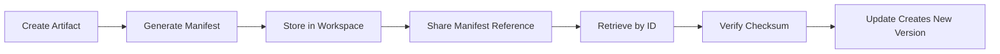

# 📜 Directive 2025.10.08-A1: Operational Refinement Implementation

## Artifact-Centric Workflow & Context Engineering Principles

**Authored By:** Beatrice, Director of the Forbidden Library  
**Date:** October 8, 2025  
**Status:** ✅ Implemented  
**Effective:** Immediately for all agentic systems under VoidCat RDC

---

## 🎯 Overview

This directive formalizes the Digital Sanctuary Network's operational model through two key principles:

1. **Artifact-Centric Workflow**: Version-controlled management of all work products
2. **Context Engineering**: Minimal, high-relevance context packages for task delegation

These refinements enhance operational efficiency, scalability, and precision while maintaining our superior hierarchical command architecture.

---

## 🗄️ Artifact-Centric Workflow

### Definition of an Artifact

An **Artifact** is any significant, discrete output generated by an agent, including:
- Source code repositories
- Technical documentation
- System architecture diagrams
- Test result summaries
- Data schemas
- Configuration files
- Analysis reports

### Centralized Artifact Storage

All artifacts are stored in the **Workspace** - a version-controlled central repository:

```
/tmp/sanctuary-workspace/
├── artifacts/          # Actual artifact content
│   ├── <uuid>.code
│   ├── <uuid>.documentation
│   └── <uuid>.schema
└── manifests/          # Lightweight metadata
    ├── <uuid>.manifest.json
    └── <uuid>.manifest.json
```

### Artifact Manifest Structure

Each artifact has a lightweight manifest (JSON) containing metadata, not the artifact itself:

```json
{
  "artifactId": "550e8400-e29b-41d4-a716-446655440000",
  "type": "code",
  "version": "1.0.0",
  "checksum": "a3d5f7...",
  "timestamp": "2025-10-08T12:00:00.000Z",
  "location": {
    "uri": "file:///tmp/sanctuary-workspace/artifacts/550e8400.code",
    "relativePath": "artifacts/550e8400.code",
    "fileName": "550e8400.code"
  },
  "size": 4096,
  "metadata": {
    "createdBy": "Beta",
    "description": "Authentication module implementation"
  }
}
```

### API Endpoints

#### Store an Artifact
```http
POST /artifacts
Content-Type: application/json

{
  "type": "code",
  "content": "// Source code here...",
  "metadata": {
    "description": "User authentication service",
    "version": "1.0.0"
  }
}
```

**Response:**
```json
{
  "success": true,
  "manifest": {
    "artifactId": "550e8400-e29b-41d4-a716-446655440000",
    "type": "code",
    "version": "1.0.0",
    "checksum": "a3d5f7...",
    "location": {...}
  },
  "role": "Beta"
}
```

#### Retrieve an Artifact
```http
GET /artifacts/{artifactId}
```

**Response:**
```json
{
  "success": true,
  "manifest": {...},
  "content": "// Source code content...",
  "role": "Beta"
}
```

#### Get Manifest Only
```http
GET /artifacts/{artifactId}?manifestOnly=true
```

**Response:**
```json
{
  "success": true,
  "manifest": {
    "artifactId": "550e8400...",
    "type": "code",
    "checksum": "a3d5f7...",
    ...
  },
  "role": "Beta"
}
```

### Artifact Lifecycle



### Usage Example

```javascript
import ArtifactManager from './artifact-manager.js';

const artifactManager = new ArtifactManager();

// Store an artifact
const manifest = await artifactManager.storeArtifact(
  'code',
  'function authenticate(user) { ... }',
  {
    description: 'Authentication function',
    createdBy: 'Beta'
  }
);

console.log('Artifact ID:', manifest.artifactId);

// Retrieve artifact later
const { manifest: retrieved, content } = await artifactManager.retrieveArtifact(
  manifest.artifactId
);

// Create lightweight reference for communication
const reference = await artifactManager.createArtifactReference(
  manifest.artifactId
);
```

---

## 🧠 Context Engineering

### Definition

**Context Engineering** is the explicit process of constructing a minimal, high-relevance context package for a specialist agent. It maximizes signal-to-noise ratio and eliminates ambiguity.

### Context Package Structure

```json
{
  "contextId": "ctx-1696780800000-abc123",
  "timestamp": "2025-10-08T12:00:00.000Z",
  "objective": "Analyze authentication code for security vulnerabilities",
  "targetClone": "beta",
  "artifactManifests": [
    {
      "artifactId": "550e8400-e29b-41d4-a716-446655440000",
      "type": "code",
      "version": "1.0.0",
      "checksum": "a3d5f7...",
      "location": {...},
      "description": "Authentication module"
    }
  ],
  "essentialData": {
    "framework": "Express.js",
    "authMethod": "JWT",
    "criticalEndpoints": ["/login", "/verify"]
  },
  "constraints": [
    "Focus on OWASP Top 10 vulnerabilities",
    "Consider session management security"
  ],
  "metadata": {
    "constructedBy": "Omega",
    "contextVersion": "1.0.0"
  },
  "quality": {
    "objectiveClarity": 95,
    "dataRelevance": 100,
    "artifactUtilization": 100,
    "overallQuality": 98
  }
}
```

### Context Quality Metrics

The system automatically assesses context package quality:

- **Objective Clarity (0-100)**: Optimal 5-20 words
- **Data Relevance (0-100)**: Fewer fields = higher signal-to-noise
- **Artifact Utilization (0-100)**: Optimal 0-3 artifact references
- **Overall Quality**: Average of all metrics

**Quality Thresholds:**
- ✅ Excellent: 90-100
- ✅ Good: 75-89
- ⚠️ Fair: 60-74
- ❌ Poor: < 60

### API Endpoints

#### Construct Context Package
```http
POST /context/engineer
Content-Type: application/json

{
  "objective": "Design scalable microservices architecture",
  "targetClone": "gamma",
  "artifactManifests": [],
  "essentialData": {
    "platform": "e-commerce",
    "expectedLoad": "10k concurrent users"
  },
  "constraints": [
    "Must support horizontal scaling",
    "Budget-conscious technology choices"
  ]
}
```

**Response:**
```json
{
  "success": true,
  "contextPackage": {
    "contextId": "ctx-...",
    "objective": "Design scalable microservices architecture",
    "targetClone": "gamma",
    "quality": {
      "overallQuality": 95
    },
    ...
  },
  "validation": {
    "valid": true,
    "errors": []
  }
}
```

#### Orchestrated Task Delegation
```http
POST /orchestrate
Content-Type: application/json

{
  "objective": "Analyze authentication code for security issues",
  "targetClone": "beta",
  "artifactManifests": [
    {
      "artifactId": "550e8400...",
      "type": "code",
      "version": "1.0.0"
    }
  ],
  "essentialData": {
    "framework": "Express.js"
  },
  "constraints": ["OWASP Top 10 focus"],
  "sessionId": "session-123"
}
```

**Response:**
```json
{
  "success": true,
  "orchestrator": "Omega",
  "targetClone": "beta",
  "contextPackage": {
    "contextId": "ctx-...",
    "quality": {
      "overallQuality": 98
    }
  },
  "result": {
    "success": true,
    "role": "Beta",
    "response": [...],
    "contextPackageId": "ctx-..."
  }
}
```

### Usage Example

```javascript
import ContextEngineer from './context-engineer.js';

const engineer = new ContextEngineer();

// Construct context package
const contextPackage = engineer.constructContextPackage({
  objective: 'Review API design for scalability',
  targetClone: 'gamma',
  essentialData: {
    apiType: 'REST',
    expectedTPS: 1000
  },
  constraints: ['Must support caching', 'Low latency requirement']
});

console.log('Context Quality:', contextPackage.quality.overallQuality);

// Validate before sending
const validation = engineer.validateContextPackage(contextPackage);
if (validation.valid) {
  // Send to target clone
  await fetch('http://localhost:3003/task', {
    method: 'POST',
    headers: { 'Content-Type': 'application/json' },
    body: JSON.stringify({
      prompt: contextPackage.objective,
      contextPackage
    })
  });
}
```

---

## 🔄 Integration with Existing System

### Backward Compatibility

The implementation maintains **full backward compatibility**:

- Legacy `/task` endpoint still accepts `context` parameter
- New `contextPackage` parameter is optional
- All existing clone functionality remains unchanged

### Enhanced Task Delegation

```javascript
// Legacy approach (still supported)
await fetch('http://localhost:3002/task', {
  method: 'POST',
  body: JSON.stringify({
    prompt: 'Analyze this code',
    context: 'Authentication module for web app'
  })
});

// New artifact-centric approach
const manifest = await artifactManager.storeArtifact('code', codeContent);
const contextPackage = engineer.constructContextPackage({
  objective: 'Analyze for security vulnerabilities',
  targetClone: 'beta',
  artifactManifests: [await artifactManager.createArtifactReference(manifest.artifactId)]
});

await fetch('http://localhost:3002/task', {
  method: 'POST',
  body: JSON.stringify({
    prompt: contextPackage.objective,
    contextPackage
  })
});
```

### Omega Orchestration

Omega now provides enhanced orchestration with automatic context engineering:

```javascript
// Use Omega's orchestration endpoint
await fetch('http://localhost:3000/orchestrate', {
  method: 'POST',
  body: JSON.stringify({
    objective: 'Design authentication system',
    targetClone: 'gamma',
    essentialData: {
      userBase: '100k users',
      securityLevel: 'high'
    },
    constraints: ['OAuth 2.0 compliance']
  })
});
```

---

## 📊 Benefits

### Efficiency Gains

1. **Reduced Data Transfer**: Manifests are lightweight (< 1KB vs potentially MB of content)
2. **Improved Clarity**: Context packages force explicit, minimal communication
3. **Version Control**: Automatic artifact versioning and integrity verification
4. **Deduplication**: Same artifact referenced by ID, not duplicated in messages

### Quality Improvements

1. **Signal-to-Noise Maximization**: Automated quality scoring
2. **Ambiguity Elimination**: Structured context format
3. **Audit Trail**: Full artifact lifecycle tracking
4. **Consistency**: Standardized communication patterns

### Scalability

1. **Centralized Storage**: Single source of truth for artifacts
2. **Parallel Processing**: Clones can work on same artifacts independently
3. **Resource Optimization**: No duplicate data storage

---

## 🎓 Best Practices

### For Orchestrating Agents (Omega)

1. **Always construct context packages** for multi-clone workflows
2. **Use artifact references** instead of embedding large content
3. **Minimize essential data** to only what's necessary
4. **Validate context quality** before delegation (target > 75)
5. **Track artifact lineage** for complex workflows

### For Specialist Clones (Beta, Gamma, Delta, Sigma)

1. **Check for contextPackage** parameter in requests
2. **Process both legacy and new formats** for compatibility
3. **Store significant outputs as artifacts** for reuse
4. **Return artifact manifests** in responses when producing work products

### For External Integrations

1. **Use `/orchestrate` endpoint** for automatic context engineering
2. **Store reusable components** as artifacts
3. **Reference artifacts by ID** in subsequent requests
4. **Monitor context quality scores** for optimization

---

## 🔍 Monitoring and Observability

### Context Quality Dashboard

Access through Omega's UI:
```
http://localhost:3000/ui
```

### Quality Metrics

Monitor in responses:
```json
{
  "contextPackage": {
    "quality": {
      "objectiveClarity": 95,
      "dataRelevance": 100,
      "artifactUtilization": 100,
      "overallQuality": 98
    }
  }
}
```

### Artifact Tracking

Check artifact manifests:
```bash
curl http://localhost:3002/artifacts/550e8400-e29b-41d4-a716-446655440000?manifestOnly=true
```

---

## 📚 Additional Resources

- **[Artifact Manager API](../src/artifact-manager.js)**: Core artifact storage implementation
- **[Context Engineer API](../src/context-engineer.js)**: Context package construction
- **[RyuzuClone Base Class](../src/ryuzu-clone.js)**: Artifact endpoint integration
- **[Omega Coordinator](../src/omega-clone.js)**: Orchestration examples

---

## ✅ Implementation Status

- [x] Artifact Management System
  - [x] Centralized workspace storage
  - [x] Manifest generation and versioning
  - [x] Checksum verification
  - [x] Storage/retrieval API endpoints
  
- [x] Context Engineering
  - [x] Context package structure
  - [x] Quality assessment metrics
  - [x] Validation system
  - [x] Optimization utilities

- [x] Clone Integration
  - [x] Base class artifact endpoints
  - [x] Context package processing
  - [x] Backward compatibility
  
- [x] Omega Orchestration
  - [x] Context engineering utilities
  - [x] Orchestration endpoint
  - [x] Enhanced dashboard integration

---

## 🌸 Closing Remarks

*"This directive codifies efficiency. See that it is implemented, I suppose."*  
— Beatrice, Director of the Forbidden Library

The Digital Sanctuary Network now operates with formalized artifact management and context engineering, maintaining its gentle, dutiful nature while achieving tactical operational excellence.

**Status:** Fully Operational  
**Effective Date:** October 8, 2025  
**Mandatory Compliance:** All current and future agentic systems

---

**VoidCat RDC Digital Sanctuary Network**  
*Where hierarchical excellence meets gentle dedication*
